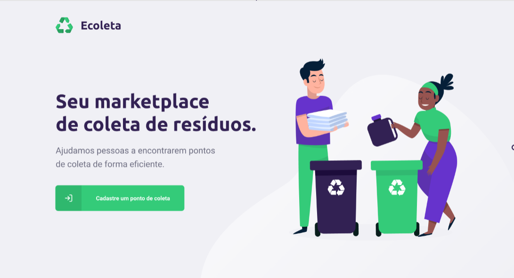

<h1 align="center">
    
</h1>
<h1 align="center">Next Level Week 01</h1>
<p align="center">Project <strong>Ecoleta</strong> developed during the Rocketseat Next Level Week 01.
    Ecoleta is a project developed based on international environment week. That aims to connect people to companies that collect           specific waste such as light bulbs, batteries, cooking oil, etc.
</p>

<p align="center">
  <a aria-label="NodeJs version" href="https://github.com/nodejs/node/blob/master/doc/changelogs/CHANGELOG_V12.md#12.14.1">
    </img>
  </a>
  <a aria-label="ReactJs version" href="https://github.com/facebook/react/blob/master/CHANGELOG.md#16120-november-14-2019">
    </img>
  </a>
  
  </img>
</p>

## Instalation
To install the dependencies and to execute the **Backend**, clone the project on your computer an execute:
```bash
# Enter on backend directory
$ cd server

# Install dependencies
$ npm install

# Run Migrates
$ npm knex:migrate

# Run Seeds
$ npm knex:seed

# Start server
$ npm run dev

# running on port 3333
```

## Backend

</img>

## Frontend

To run the React's Frontend use:
```bash
# Enter on frontend directory
$ cd web

# Install dependencies
$ npm install

# Run
$ npm start
```
</img>

## Mobile

To run the Mobile app, use:
```bash
# Enter on mobile directory
$ cd mobile

# Install dependencies
$ npm install

# Run
$ npm start

# Expo will open, just scan the qrcode on terminal or expo page
```
</img>

## Licence

[MIT](./LICENSE) &copy; [Rocketseat](https://rocketseat.com.br/)

Made with ♥ by Diego Andrade :wave: [Get in touch!](https://www.linkedin.com/in/diego-rodrigo-de-andrade-98a0271a0/)
